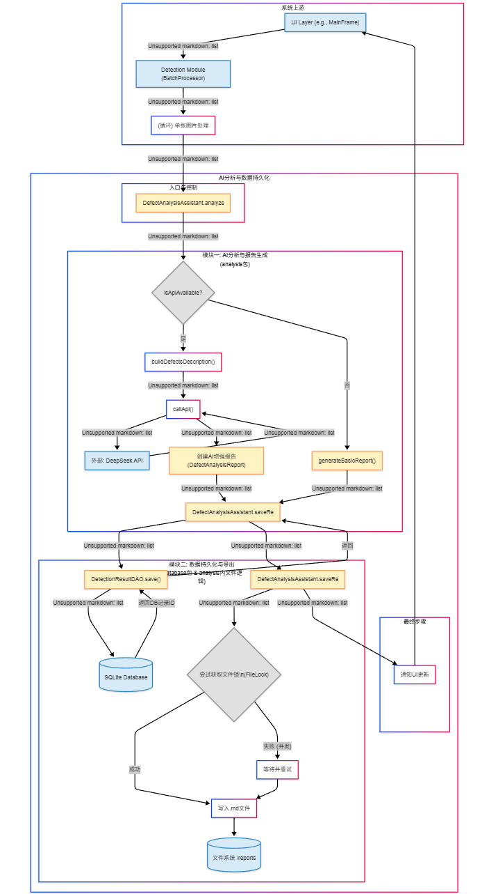

# 布匹缺陷检测与分析系统 (Fabric Defect Detection & Analysis System)

这是一个基于Java Swing和OpenCV开发的桌面应用程序，用于自动检测布匹图像中的缺陷，并利用AI服务生成专业的质量分析报告。

**项目仓库地址**: [https://github.com/Sanmu-27/Fabric-Defect-Detection-System](https://github.com/Sanmu-27/Fabric-Defect-Detection-System)

## ✨ 主要功能

- **实时缺陷检测**: 利用OpenCV对上传的布匹图片进行处理，准确识别多种缺陷。
- **AI智能分析**: 集成外部API，对检测结果进行深度分析，生成包含成因、建议的专业报告。
- **批量处理**: 支持对整个文件夹的图片进行批量检测。
- **历史记录**: 所有检测结果和报告都存储在SQLite数据库中，方便查询。
- **报告导出**: 支持将分析报告以Markdown格式导出。

## 🏛️ 系统架构


*如果图片仍未显示，请确保您已将`architecture.png`文件上传到项目的`assets`文件夹中。*

## 🚀 如何运行

### 1. 环境准备
- 安装 **JDK 8 或更高版本**。
- **配置OpenCV本地库**：确保将OpenCV的`build/java/x64`目录下的动态链接库文件（如`opencv_java455.dll`）路径添加到系统的`PATH`环境变量中。

### 2. 下载与配置
- **克隆项目**:
  ```bash
  git clone https://github.com/Sanmu-27/Fabric-Defect-Detection-System.git
  cd Fabric-Defect-Detection-System
  ```
- **配置API密钥**:
  在`src`目录下创建一个`config.properties`文件，并填入您的API密钥：
  ```properties
  DEEPSEEK_API_KEY=sk-xxxxxxxxxxxxxxxxxxxxxxxx
  ```

### 3. 编译与运行 (Windows)
- **编译**: 双击 `compile.bat`。
- **运行**: 双击 `run.bat`。

## 👤 我的贡献

在此项目中，我主要负责以下两个核心模块的设计与开发：
1.  **AI分析与报告生成模块** (`analysis`包)
2.  **数据持久化与导出模块** (`database`包)
